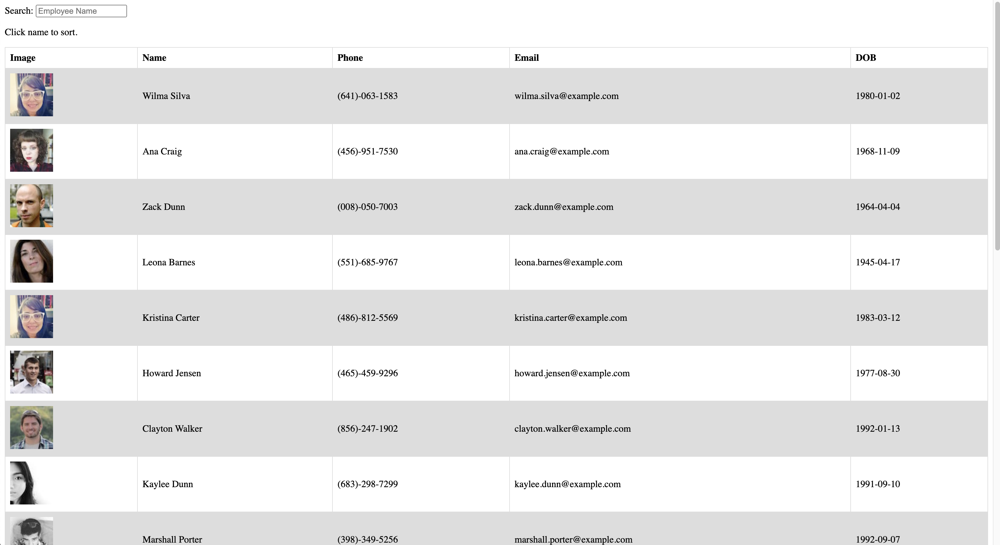

# Employee Directory

- [About](#about)
- [User Story](#user_story)
- [Link](#link)
- [Screenshot](#screenshot)
- [License](#license)

## About
This application is an exercise to use React. To have a basic understanding of React library, things like class component, props, and react lifecycle.

## User_Story

* As a user, I want to be able to view my entire employee directory at once so that I have quick access to their information.

## Link
[Employee Directory](https://terry0532.github.io/employee_directory/)

## Screenshot

## License

[MIT License](LICENSE)